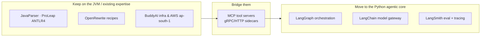
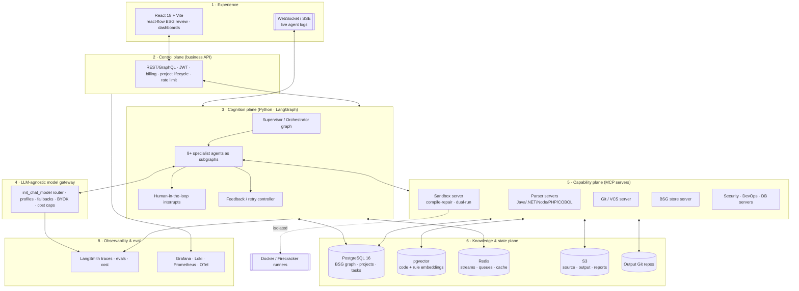
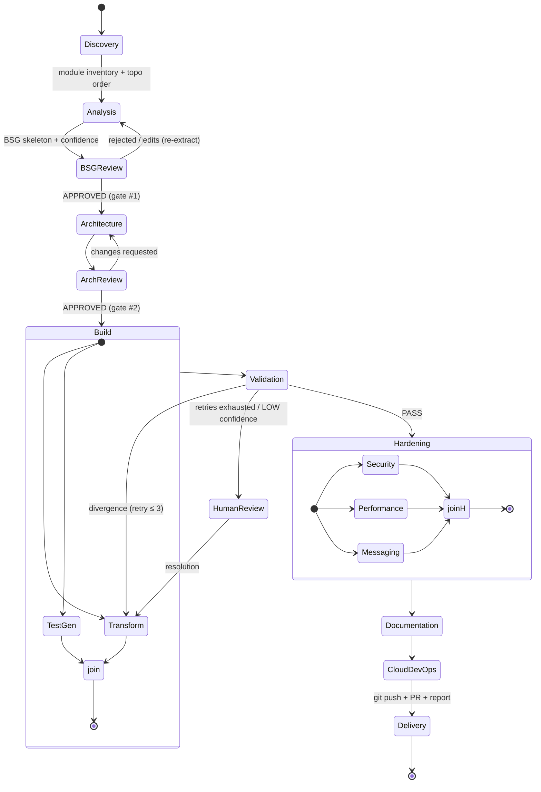
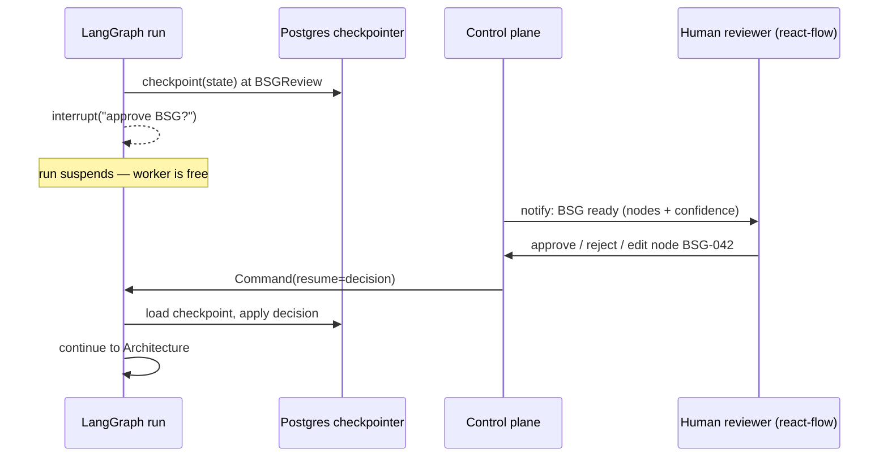
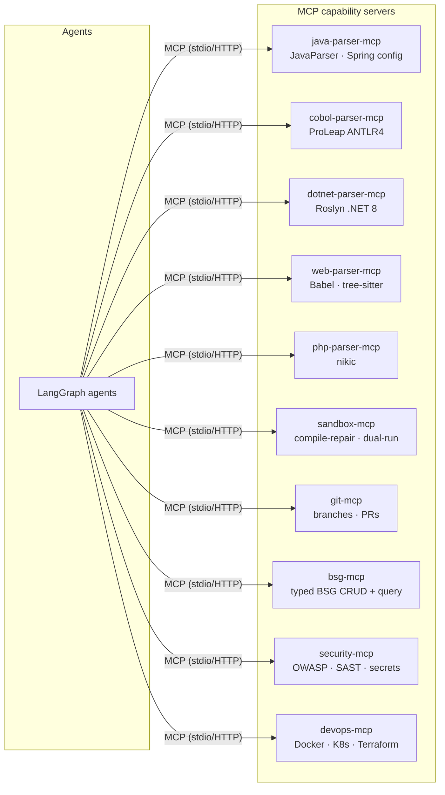
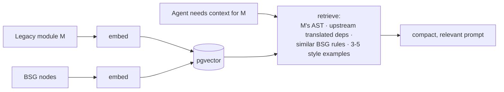
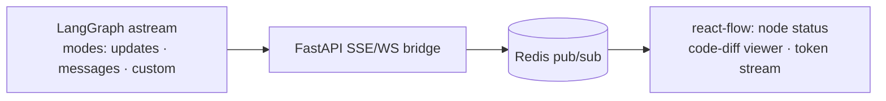
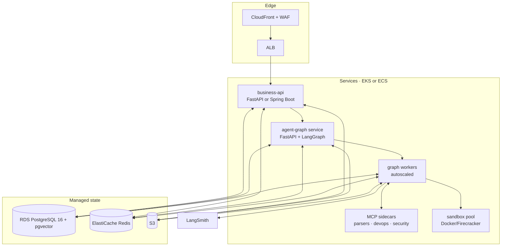

# CodeShift — Fully Agentic Architecture Design (v2)

> **Scope.** This document redesigns the CodeShift platform described in
> *CodeShift — Complete Product Document v1.0 (July 2026)* as a **fully agentic,
> LLM‑agnostic system built on LangChain + LangGraph**. It keeps every product
> promise (BSG trust boundary, 8‑agent pipeline, human review gates, dual‑run
> validation, 10 pillars) but re‑expresses the pipeline as a **durable,
> resumable, observable agent graph** rather than a hand‑rolled orchestrator.
>
> **Status:** design proposal · **Audience:** founder + first engineers ·
> **Companion:** [`implementation-plan.md`](./implementation-plan.md)

---

## 1. Design goals & principles

The product doc already names the hard constraints. This architecture turns them
into first‑class system properties.

| Product promise (v1 doc) | Architectural property | How this design delivers it |
| --- | --- | --- |
| "BSG is the trust boundary between AI understanding and AI output" | **Single source of truth**, versioned, human‑gated | BSG is durable state in Postgres; every agent reads/writes it through one typed store, never free‑text |
| "Coordinated, not autonomous… every gate has a human review option" | **Durable human‑in‑the‑loop** | LangGraph `interrupt()` + Postgres checkpointer — a gate can pause for days and resume exactly where it stopped |
| "Sequential with feedback loops… Validation → Transformation retry" | **Cyclic, bounded control flow** | LangGraph conditional edges model retries with explicit max‑attempt guards |
| "Any source language… parser is a plugin" | **Pluggable capability plane** | Parsers/sandboxes/scanners are **MCP servers**; adding a language = registering a tool server, no orchestrator change |
| "LLM‑agnostic" *(your new requirement)* | **Provider‑abstracted model gateway** | LangChain `init_chat_model` + per‑role model profiles + fallback chains + BYOK |
| "Price per kLOC covers LLM cost… context compression after 10 turns" | **Cost as a governed budget** | Token accounting per agent task (LangSmith) enforced against a per‑project budget |
| "No LLM training on client code… VPC‑private" | **Tenant isolation by construction** | Ephemeral sandboxes, per‑tenant keys, no‑train provider flags, private networking |

**Guiding principles**

1. **Determinism first, LLM second.** Anything mechanical (topological sort,
   OpenRewrite recipes, `lib2to3`, DDL type mapping, dependency parsing) runs as
   plain code. The LLM is reserved for *meaning* — rule extraction and semantic
   translation. This is the single biggest lever on cost and hallucination.
2. **The graph is the process.** The pipeline, its gates, its retries and its
   parallel branches are *data* (a LangGraph `StateGraph`), not imperative glue.
   New pillars are new nodes/subgraphs.
3. **Everything is resumable.** Long migrations span hours and human reviews span
   days. Durable checkpoints make every step crash‑safe and pause‑safe.
4. **Every token is traced and priced.** No agent call happens outside the
   observability + cost envelope.
5. **The BSG never lives in a prompt.** It lives in a store; prompts receive
   *retrieved, relevant slices* of it. This keeps context small on 100k+ LOC.

---

## 2. What changes from the v1 (Java/LangChain4j) plan

The v1 doc chose Java 21 + Spring Boot + **LangChain4j**. Your requirement to use
**LangChain + LangGraph** and be **LLM‑agnostic** implies a **polyglot split**,
not a rewrite — we keep the JVM where it is strongest (parsers) and move the
*cognition* to Python where the agent ecosystem is richest.



- **Cognition plane → Python.** LangGraph + LangChain + LangSmith are Python‑first
  and move fastest here. This is where the 8 agents, the graph, the gates and the
  feedback loop live.
- **Parser plane → stays polyglot.** JavaParser/ProLeap (JVM), Roslyn (.NET 8),
  Babel/tree‑sitter (Node), nikic (PHP) run as **language‑analysis sidecars**
  exposed over **MCP**. The founder's Java expertise is fully reused here.
- **Control/business plane → your choice.** Either keep Spring Boot for the
  REST/billing surface (reuse BuddyAI patterns) *or* consolidate on FastAPI.
  Recommendation: **FastAPI for the agent/graph service + a thin Spring Boot or
  FastAPI business API** — see §12. Both talk to the same Postgres.

> **Net effect:** the LangChain4j line item in the v1 stack is replaced by
> LangGraph (orchestration) + LangChain (model abstraction) + LangSmith
> (observability/eval), and parsers become MCP servers instead of in‑process
> libraries.

---

## 3. Architecture at a glance



The eight numbered planes map to the sections below. Planes 6/7 are the durable
substrate; plane 3 is the "brain"; plane 5 is how the brain touches the world.

---

## 4. The cognition plane — LangGraph orchestration

### 4.1 Why LangGraph (not a bespoke orchestrator)

The v1 doc describes a pipeline that is *exactly* what LangGraph exists to model:

- **Explicit state machine** with typed shared state (the BSG + run context).
- **Cycles** — Validation → Transformation retry is a back‑edge with a counter.
- **Human‑in‑the‑loop** — `interrupt()` pauses a run at a review gate and a
  **durable checkpointer** lets it resume hours/days later, on any worker.
- **Parallel fan‑out/fan‑in** — Test Generation runs *in parallel* with
  Transformation, then both join before Validation.
- **Streaming** — token/step events stream to the UI for the "live agent logs"
  WebSocket the product requires.
- **First‑class persistence & time‑travel** — every gate decision, retry and
  cost is checkpointed; you can replay or fork a run for debugging and audits.

Building this by hand (the v1 `AgentOrchestrator` + `FeedbackLoopManager`) means
re‑implementing durable execution, HITL and streaming. LangGraph gives them out
of the box.

### 4.2 The master migration graph



- **Conditional edges** encode the doc's rules: `Messaging` only runs if the
  Discovery/Analysis phase flagged JMS/MQ/AMQP patterns; the security gate blocks
  `Delivery` on any critical CVE/SAST finding.
- **Retry guards** are explicit: `retry_count` lives in state; the
  Validation→Transform edge is taken only while `retry_count < 3`, otherwise it
  routes to `HumanReview` (matches "max 3 agent retries then human review").
- **Gates** (`BSGReview`, `ArchReview`, `HumanReview`, and topic‑design review
  inside `Messaging`) are `interrupt()` points.

### 4.3 Agent‑as‑subgraph pattern

Each of the 8 agents is its own compiled subgraph with a stable contract, so it
can be developed, evaluated and versioned independently and reused across the 10
pillars.

```python
# agents/base.py — every specialist agent implements this shape
class AgentIO(TypedDict):
    project_id: str
    bsg_ref: str            # pointer into the BSG store, NOT the whole BSG
    scope: ModuleScope      # which modules/nodes this invocation touches
    budget: TokenBudget

def build_agent_subgraph(
    role: AgentRole,             # DISCOVERY, ANALYSIS, ARCHITECTURE, ...
    model_profile: ModelProfile, # reasoning | codegen | cheap | embed
    tools: list[MCPTool],
) -> CompiledStateGraph: ...
```

A specialist agent is "a distinct LLM call with a specialised system prompt,
domain expertise, and defined inputs/outputs" (v1 doc §5) — here that becomes a
subgraph node bound to (a) a **prompt** from the versioned prompt registry,
(b) a **model profile** resolved by the gateway, and (c) a **tool set** from the
MCP registry.

### 4.4 BSG‑centric shared state

LangGraph state must stay **small and serialisable** — so it holds *references*,
not payloads. The heavy artifacts (BSG nodes, code, test results) live in
Postgres/S3 and are fetched on demand.

```python
class MigrationState(TypedDict):
    project_id: str
    phase: Phase
    bsg_version_id: str                 # current approved/working BSG snapshot
    topo_order: list[str]               # module ids, leaf-first (Kahn)
    module_cursor: int                  # progress through topo_order
    retry_count: dict[str, int]         # per-module transformation retries
    open_review_items: list[ReviewRef]  # HITL queue references
    divergences: list[DivergenceRef]    # from Validation
    budget: TokenBudget                 # remaining $ / tokens for the project
    messages: Annotated[list, add_messages]  # scoped, compacted working memory
```

- **Retrieval over stuffing.** An agent working on module `M` pulls only: `M`'s
  parsed AST + BSG nodes, its already‑translated upstream dependencies (guaranteed
  present by leaf‑first topo order), and 3–5 style‑example files via pgvector
  similarity. This is how "new code is indistinguishable from migrated code"
  (v1 §7.2) is achieved *and* how context stays bounded on 100k+ LOC.
- **Context compression** (v1 risk mitigation) is a reducer on `messages` that
  summarises after N turns.

### 4.5 Durable human‑in‑the‑loop



Because the checkpoint is durable, the reviewer can return **days later**, the
run resumes on **any** worker, and the full decision history is the **audit
trail** the product sells to regulated industries (v1 §4.3).

### 4.6 Bounded feedback loop (the "key innovation")

The Validation Agent emits a **structured** `DivergenceReport` (not prose), which
the controller turns into a targeted retry:

```python
def route_after_validation(state) -> str:
    if state["validation"].status == "PASS":
        return "hardening"
    module = state["validation"].failing_module
    if state["retry_count"][module] >= 3:
        return "human_review"          # escalate — matches product spec
    return "transform_retry"           # targeted, with divergence context injected
```

The retry does **not** re‑run the whole pipeline — only the failing module's
Transformation node, seeded with the divergence (input that triggered it,
expected vs actual output). This is the doc's "structured failure report back to
the Transformation Agent for targeted retry."

---

## 5. LLM‑agnostic model gateway

This is the core of your "LLM‑agnostic" requirement. Every model call in the
system goes through one gateway; **no agent hard‑codes a provider**.

### 5.1 Provider abstraction

```python
from langchain.chat_models import init_chat_model

# Same call, any provider — chosen by config, not code.
model = init_chat_model(
    settings.profiles[role].model,   # e.g. "anthropic:claude-sonnet-4-6"
    model_provider=None,             # inferred from the prefix
    temperature=settings.profiles[role].temperature,
    max_tokens=settings.profiles[role].max_tokens,
)
```

Supported providers via one interface: **Anthropic, OpenAI, Google Gemini, AWS
Bedrock, Azure OpenAI, Mistral, Cohere, and local models via Ollama / vLLM**.
Switching a role from Claude to Gemini or a self‑hosted Llama is a config change.

> The v1 doc names `claude-sonnet-4-6` as primary. Under the *latest* Claude
> lineup the sensible defaults are **Claude Opus 4.8** for the hardest reasoning
> (Analysis/Architecture) and **Claude Sonnet / Haiku 4.5** for high‑volume
> codegen/classification — but nothing in the system depends on that choice.

### 5.2 Model profiles (per agent role)

Different agents need different capabilities; the gateway resolves a **profile**,
not a model name, so cost/quality can be tuned centrally.

| Profile | Used by | Optimised for | Example default | Fallback |
| --- | --- | --- | --- | --- |
| `reasoning` | Analysis (BSG), Architecture, Portfolio | deep reasoning, long context | frontier model (e.g. Opus‑class) | second frontier provider |
| `codegen` | Transformation, Test Gen, DataShift proc translation | code quality, structured output | mid‑tier (Sonnet‑class) | alt provider mid‑tier |
| `cheap` | Discovery classify, secrets triage, routing | throughput & price | small/fast (Haiku‑class) | local model |
| `embed` | RAG over code + BSG | embedding quality | provider embeddings or local `bge`/`e5` | local fallback |

Profiles are per‑tenant overridable → **BYOK** and enterprise "use my own model
in my VPC" (on‑prem tier) fall out naturally.

### 5.3 Reliability & structured output

```python
model = (
    base_model
    .with_structured_output(BsgNode)      # Pydantic schema → typed BSG, never prose
    .with_retry(stop_after_attempt=3)
    .with_fallbacks([alt_provider_model]) # provider outage / rate limit resilience
)
```

- **Structured output everywhere** — the BSG, divergence reports, and impact
  analyses are Pydantic models validated on the way out. This is what makes the
  BSG a *typed* trust boundary rather than free text.
- **Fallback chains** give provider‑outage resilience for free — critical when a
  paid migration is mid‑flight.

### 5.4 Cost governance (ties directly to pricing)

The product prices at **$50/kLOC targeting $15–20 LLM cost per kLOC**. The
gateway enforces this:

- Every call is tagged `(project_id, agent_role, module_id)` and its token cost
  recorded to `agent_tasks.cost_usd` (schema already in v1 doc) via LangSmith.
- A **per‑project budget** lives in `MigrationState.budget`; a pre‑call hook
  refuses or downgrades (frontier → mid‑tier) when the remaining budget is thin.
- Semantic caching (Redis) on repeated prompts (e.g. re‑analysing an unchanged
  module) avoids paying twice.

---

## 6. Capability plane — MCP tool servers

Rather than embedding parsers/sandboxes as libraries (the v1 in‑process
approach), each capability is an **MCP server**. LangGraph agents load them via
the MCP adapter. This is what makes "the parser is a plugin" literally true and
keeps the polyglot reality clean.



**Why MCP specifically**

- **Language isolation.** JVM parsers, .NET Roslyn, Node/PHP tooling each run in
  their native runtime as a sidecar; the Python core never shells into them ad
  hoc.
- **Uniform tool contract.** Every capability advertises typed tools; agents
  discover them at runtime. Adding COBOL support = deploy `cobol-parser-mcp` and
  register it — **zero orchestrator change** (delivers v1 §6's promise).
- **Security surface.** Tool servers run with least privilege; the sandbox server
  is the *only* thing that executes untrusted client code, inside Docker/
  Firecracker.
- **Reuse.** The same MCP servers back the API's synchronous endpoints (e.g.
  "free assessment") and the agent graph.

**Key servers**

| MCP server | Wraps (from v1 tech stack) | Exposes to agents |
| --- | --- | --- |
| `*-parser-mcp` | JavaParser, ProLeap ANTLR4, Roslyn, Babel/tree‑sitter, nikic | `parse_module`, `build_dependency_graph`, `detect_messaging_patterns` |
| `sandbox-mcp` | Docker 27 + dual‑run comparator | `compile`, `run_tests`, `dual_run(inputs)`, `compare_outputs` |
| `bsg-mcp` | Postgres BSG tables + pgvector | `upsert_node`, `query_nodes`, `diff_versions`, `semantic_search` |
| `git-mcp` | GitService (v1 storage module) | `create_branch`, `commit`, `open_pr` |
| `security-mcp` | OWASP dep‑check, SAST, secrets, gitleaks | `scan_cves`, `sast`, `find_secrets`, `map_compliance` |
| `devops-mcp` | Dockerfile/K8s/Terraform/Actions generators | `gen_dockerfile`, `gen_k8s`, `gen_terraform`, `gen_pipeline` |
| `db-mcp` (DataShift) | ANTLR PL/SQL grammars, Debezium, Spring Batch | `extract_ddl`, `convert_ddl`, `translate_procedure`, `plan_cdc` |

---

## 7. The BSG store & knowledge plane

The BSG is the platform's "central nervous system" — so it gets a dedicated,
typed store, not a blob in agent state.

### 7.1 Graph model in Postgres

The v1 schema already defines `bsg_versions`, `bsg_nodes`, `bsg_edges`. We keep
it and add semantic search:

- **Nodes** carry the full v1 contract: `node_ref` (BSG‑042), `node_type`
  (BusinessRule / DataFlow / StateTransition / ExternalContract / EdgeCase /
  ImplicitRule / MessagingContract), `title`, plain‑English `description`,
  `source_location`, `confidence` (HIGH/MEDIUM/LOW), `human_status`
  (PENDING/APPROVED/REJECTED/MODIFIED), `target_code_location`, `test_coverage`,
  plus `origin` (MIGRATED/NEW_FEATURE/INTEGRATION/REFACTORED).
- **Edges** carry `edge_type` (depends_on / produces / validates / overrides /
  triggers).
- **Versioning** — every feature/architecture change forks a new `bsg_version`;
  the version chain *is* the business‑rule audit trail (compliance deliverable).

### 7.2 Retrieval (pgvector) — the context strategy



This is the mechanism behind two product claims at once:
- **"complete context" moat** (v1 §7.2) — the agent always sees the relevant
  neighbourhood of the codebase.
- **cost control** — the prompt never contains the whole app, only what matters,
  keeping per‑module LLM cost inside the $/kLOC envelope.

### 7.3 Other state

| Store | Holds | Notes |
| --- | --- | --- |
| PostgreSQL 16 | BSG, projects, `agent_tasks`, validation results, human review items, feature requests | system of record; owns the v1 Flyway schema |
| pgvector | code‑chunk + BSG embeddings | RAG + AI‑debt fingerprinting (v1 §8) |
| Redis 7 | LangGraph stream events, task queue, semantic cache, rate limits | ElastiCache |
| S3 | uploaded source, generated code, PDF reports | SSE‑encrypted, per‑tenant prefixes |
| Output Git repos | delivered code + CI/CD + manifests | the actual product deliverable |

---

## 8. Runtime, persistence & durable execution

- **Checkpointer:** `AsyncPostgresSaver` (LangGraph's Postgres checkpointer) →
  every super‑step is durable; crashes and HITL pauses are non‑events.
- **Store:** LangGraph `PostgresStore` for cross‑run memory (e.g. per‑tenant
  style conventions learned once, reused across migrations).
- **Workers:** graph runs execute on a horizontally‑scalable worker pool; because
  state is external, any worker can pick up any run after an interrupt.
- **Queue:** Redis/SQS in front of workers so a 100k‑LOC migration doesn't block
  the API; the v1 scaling roadmap (SQS at Phase 6) fits unchanged.
- **Deployment option:** **LangGraph Platform / LangGraph Server** can host the
  graph with built‑in persistence, streaming and a task queue if you'd rather not
  operate the checkpointer yourself early on.

---

## 9. Streaming & real‑time UX

The product needs "live WebSocket progress" and "live agent logs". LangGraph
streams multiple modes; we bridge them to the browser:



- `stream_mode="updates"` → per‑node status for the pipeline view.
- `stream_mode="messages"` → token‑by‑token for the transformation/diff view.
- `stream_mode="custom"` → agent‑emitted progress ("compiling attempt 2/5").

---

## 10. Observability, evaluation & cost accounting

The agentic core is only trustworthy if it's measurable.

- **Tracing:** LangSmith captures every agent step, tool call, prompt version,
  latency and token cost. One trace = one migration, drillable to a single BSG
  node extraction.
- **Cost:** roll‑up per project/agent/module → feeds pricing and the v1
  `analytics/agent-costs` endpoint and unit‑economics dashboard.
- **Evaluation (this is what makes it "feature ready" vs. a demo):**
  - **BSG extraction evals** — golden set of legacy snippets → expected rules;
    score precision/recall of rule extraction and confidence calibration.
  - **Transformation evals** — behavioral equivalence via the dual‑run harness on
    a fixed corpus; track compile‑first‑try rate and divergence rate per
    language.
  - **Regression gate in CI** — prompt or model changes must not regress the eval
    suite before deploy. This is how you safely swap models (LLM‑agnostic in
    practice, not just in theory).
- **Infra:** OpenTelemetry → Grafana/Loki/Prometheus (v1 stack) for the services
  themselves.

---

## 11. Security, tenancy & data governance

Directly addresses the v1 "client data security" risk (High impact).

- **Untrusted code only ever runs in the sandbox** — Docker with dropped
  capabilities, read‑only rootfs, no network egress by default; **Firecracker /
  gVisor** microVMs for the dual‑run stage where isolation matters most.
- **No‑train guarantees** — provider `no‑train`/zero‑retention flags set in the
  gateway; enterprise tier can pin to Bedrock/Azure in‑VPC or a self‑hosted model
  so code never leaves the tenant boundary.
- **Tenant isolation** — per‑tenant S3 prefixes + KMS keys, per‑tenant Postgres
  row‑level security, per‑tenant model keys (BYOK).
- **Secrets** — the Security Agent scans generated output *before* commit; the
  platform's own secrets live in AWS Secrets Manager (never in `template.yaml`,
  per this repo's existing README warning).
- **Supply chain** — MCP tool servers are pinned, signed images; the sandbox
  pulls only vetted base images.

---

## 12. Deployment topology



- **Early stage (Phase 1–3, ~$200/mo, matches v1):** single EC2/ECS task runs
  business‑api + agent‑graph + a couple of MCP sidecars; one RDS, one Redis, one
  S3. Sandbox on the same box. No autoscaling — ship, don't scale.
- **Scale (Phase 4–6):** split `agent-graph` workers onto their own autoscaling
  pool; sandbox pool isolated; RDS Multi‑AZ + read replica; SQS in front of
  workers; move to EKS at Year 2 — **identical to the v1 scaling roadmap**, just
  with the agent workers as the unit that scales.
- **Region:** AWS ap‑south‑1 (Mumbai), reusing BuddyAI footprint.

---

## 13. The 8 agents → graph nodes (traceability to the product doc)

| # | v1 Agent | Graph node(s) | Profile | Primary MCP tools | Gate / loop |
| --- | --- | --- | --- | --- | --- |
| 1 | Discovery | `discovery` (mostly deterministic) | `cheap` | parser‑mcp (`build_dependency_graph`, `detect_language`) | — |
| 2 | Analysis / BSG Builder | `analysis` (3 sub‑nodes: structural → rules → implicit) | `reasoning` | parser‑mcp, bsg‑mcp | **HITL gate #1** after |
| 3 | Architecture | `architecture` | `reasoning` | bsg‑mcp, graph algos | **HITL gate #2** after |
| 4 | Transformation | `transform` (loops with sandbox) | `codegen` | sandbox‑mcp (compile‑repair), git‑mcp, bsg‑mcp | retry loop ≤5 compile, ≤3 validation |
| 5 | Test Generation | `testgen` (parallel with `transform`) | `codegen` | sandbox‑mcp | fan‑out/fan‑in |
| 6 | Validation | `validation` | `reasoning` (compare) | sandbox‑mcp (`dual_run`, `compare_outputs`) | **feedback loop source** |
| 7 | Documentation | `documentation` | `codegen` | git‑mcp, PDF (iText7 via devops‑mcp) | — |
| 8 | Messaging Migration | `messaging` (conditional) | `codegen` | parser‑mcp (`detect_messaging_patterns`), devops‑mcp | topic‑design HITL |
| + | Security | `security` (Hardening branch) | `cheap`/`reasoning` | security‑mcp | blocks Delivery on critical |
| + | Performance | `performance` (Hardening branch) | `codegen` | sandbox‑mcp, bsg‑mcp | — |
| + | Cloud/DevOps | `cloud_devops` | `codegen` | devops‑mcp | — |
| + | Requirements (new‑code) | `requirements` (entry for pillars 3/7) | `reasoning` | bsg‑mcp | HITL on feature spec |

Pillars 4/8/9/10/11 (debt intelligence, API management, portfolio, DataShift)
are **additional subgraphs over the same BSG store and gateway** — no new
orchestrator, exactly as the product doc intends ("adding a pillar = adding
agents + a UI module").

---

## 14. Revised technology stack (latest, LLM‑agnostic)

| Layer | v1 doc | This design (latest) | Why |
| --- | --- | --- | --- |
| Agent orchestration | hand‑rolled + LangChain4j | **LangGraph** (Python) | durable HITL, cycles, streaming, checkpoints out of the box |
| LLM abstraction | LangChain4j → Claude | **LangChain `init_chat_model`** | one API, any provider → true LLM‑agnostic |
| Observability/eval | (implicit) | **LangSmith** + OpenTelemetry | trace + price + eval every agent; safe model swaps |
| Tool integration | in‑process libs | **MCP servers** | pluggable parsers/sandbox; polyglot isolation |
| Structured output | — | **Pydantic v2** | typed BSG / divergence / impact schemas |
| Agent/API runtime | Spring Boot | **FastAPI (async)** for agent+graph; Spring Boot optional for business API | Python‑first agent ecosystem; reuse Java for parsers |
| Parsers | JavaParser/ProLeap/Roslyn/Babel/nikic | **same, as MCP sidecars** | keep JVM/.NET strengths, reuse founder expertise |
| Deterministic transform | OpenRewrite | **OpenRewrite** (via java‑parser‑mcp) | cheap, exact mechanical changes before LLM |
| DB | PostgreSQL 16 + pgvector | **same** + pgvector for RAG | BSG graph + embeddings in one store |
| Cache/stream | Redis 7 | **same** | LangGraph streams, semantic cache, queue |
| Sandbox | Docker 27 | **Docker + Firecracker/gVisor** (optionally E2B) | stronger isolation for untrusted code + dual‑run |
| Frontend | React 18 + Vite + react‑flow | **same** | BSG review UX unchanged |
| CDC (DataShift) | Debezium + Spring Batch | **same, via db‑mcp** | proven CDC path |
| Packaging/CI | Maven | **uv** (Python) + Maven (JVM sidecars) + GitHub Actions | fast, reproducible polyglot builds |

---

## 15. Key architectural decisions (ADR summary)

| ADR | Decision | Rationale | Consequence |
| --- | --- | --- | --- |
| ADR‑1 | Model the pipeline as a **LangGraph StateGraph** | pipeline is inherently a cyclic, gated, parallel state machine | pipeline changes are graph edits, not code rewrites |
| ADR‑2 | **Polyglot split**: Python cognition, JVM/.NET parsers as MCP | best agent ecosystem + reuse existing parser expertise | one network hop to parsers; clean isolation |
| ADR‑3 | **`init_chat_model` gateway + profiles** | genuine LLM‑agnosticism, per‑role tuning, BYOK | no provider lock‑in; models are config |
| ADR‑4 | **BSG in Postgres, referenced (not embedded) in state** | scale to 100k+ LOC; keep prompts small | retrieval layer required (pgvector) |
| ADR‑5 | **Durable Postgres checkpointer** | HITL gates span days; crash safety | runs are resumable on any worker |
| ADR‑6 | **Deterministic before LLM** (OpenRewrite, topo sort, DDL maps) | −cost, −hallucination | more non‑LLM code, but cheaper & safer |
| ADR‑7 | **Structured (Pydantic) outputs only** for BSG/divergence | typed trust boundary, validatable | schema evolution discipline needed |
| ADR‑8 | **Evals gate model/prompt changes in CI** | safe swaps; "feature ready" not "demo" | need golden corpora per language |

---

## 16. Risks introduced by the agentic design (and mitigations)

| Risk | Mitigation |
| --- | --- |
| Polyglot ops complexity (Python + JVM + .NET sidecars) | MCP standardises the boundary; each sidecar is a small, independently deployable image; start with only the Java parser (P0) |
| LangGraph/LangChain API churn | pin versions; isolate framework touchpoints behind `agents/base.py`; eval suite catches behavioural regressions on upgrade |
| Non‑determinism across providers when "LLM‑agnostic" | structured outputs + eval gate per provider; certify a provider before enabling it for a tenant |
| Cost blowups on huge repos | per‑project token budget in state + retrieval‑not‑stuffing + semantic cache + downgrade hook |
| Sandbox escape (untrusted client code) | Firecracker/gVisor, no egress, ephemeral, least‑privilege MCP servers |
| Solo‑founder delivery risk (v1's top risk) | the graph lets you ship **one vertical slice** (Discovery→Assessment) as a product in weeks, then add nodes — see the implementation plan |

---

## 17. How this stays true to the product

Every headline claim in the product doc has a concrete home in this architecture:

- **BSG as trust boundary** → typed `bsg-mcp` store + Pydantic schemas + HITL gate.
- **8 coordinated agents** → 8 subgraphs on one supervisor graph.
- **Feedback loop** → bounded cyclic edge Validation→Transform with structured divergences.
- **Environment‑in‑the‑Loop dual‑run** → `sandbox-mcp.dual_run` + comparator.
- **Any language, parser‑as‑plugin** → parser MCP servers, register‑to‑add.
- **LLM‑agnostic** → `init_chat_model` gateway + profiles + fallbacks + BYOK.
- **Continuous modernisation / 10 pillars** → additional subgraphs over shared BSG + gateway.
- **Compliance audit trail** → durable checkpoints + BSG version chain.
- **$/kLOC economics** → per‑call cost accounting + project budget enforcement.

See [`implementation-plan.md`](./implementation-plan.md) for the phased build.
