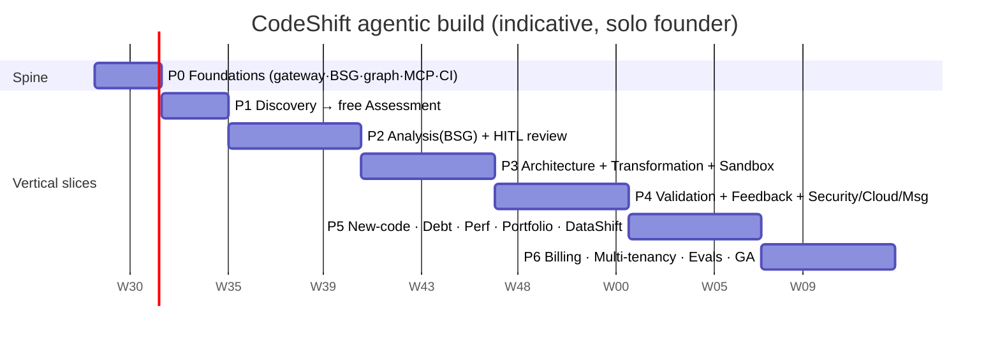

# CodeShift — Implementation Plan (Agentic / LangGraph build)

> Companion to [`agentic-architecture.md`](./agentic-architecture.md). This plan
> rebuilds CodeShift's v1 "6 phases / 36 weeks" schedule around the agentic
> stack. It keeps the v1 **revenue milestones** unchanged and reorders the
> *engineering* so that a **shippable vertical slice** exists as early as
> possible — the single most important thing for a solo founder.

---

## 0. Strategy in one paragraph

Build the **spine first** (model gateway → BSG store → LangGraph skeleton →
one MCP parser → streaming), then grow it **one agent node at a time**. Every
phase ends with something a customer can *use*, not just a component that exists.
P0 stays **Java 8 → Java 21** because the parser is mature, OpenRewrite does the
mechanical work deterministically, and the Nov‑2026 deadline is the wedge.



---

## Phase 0 — Foundations / the spine (weeks 1–3)

**Goal:** the smallest end‑to‑end skeleton that can run a trivial graph, call any
LLM, persist state, stream to a UI, and be traced. No product value yet — this is
the rig everything else clips onto.

**Deliverables**
- **Monorepo scaffold** (see §"Repo layout") with `uv` workspaces + one JVM
  Maven sidecar.
- **Model gateway** (`packages/model-gateway`): `init_chat_model` wrapper,
  `ModelProfile` config (`reasoning`/`codegen`/`cheap`/`embed`), `.with_retry`
  + `.with_fallbacks`, structured‑output helper, cost hook → LangSmith.
  Prove it by running the same prompt against **two providers** from config.
- **BSG store + `bsg-mcp`**: Postgres 16 + pgvector, Alembic/Flyway migrations
  for `bsg_versions/nodes/edges` (+ `projects`, `agent_tasks`), MCP server with
  `upsert_node`/`query_nodes`/`diff_versions`/`semantic_search`.
- **LangGraph skeleton**: a 2‑node `StateGraph` with the Postgres checkpointer;
  prove **interrupt → resume** works across a process restart.
- **Streaming bridge**: FastAPI SSE/WS endpoint relaying `astream` events.
- **Observability**: LangSmith project wired; one trace visible end‑to‑end.
- **CI**: GitHub Actions — lint, type‑check (mypy/pyright), unit tests, build all
  images; **eval job stub**.

**Exit criteria:** `POST /runs` starts a graph, it pauses at an `interrupt`, a
`POST /runs/{id}/resume` continues it after a restart, and the whole thing shows
one LangSmith trace with token cost. Model provider is swappable by env var.

---

## Phase 1 — Discovery → free Assessment (weeks 4–6)

**Goal:** the **top‑of‑funnel product** ships. Anyone uploads a Java 8 codebase
and gets a dependency graph + module inventory + assessment report — no account.
This is the v1 lead magnet and the first demo.

> **Status (backend core landed):** ✅ `codeshift-parser` (JavaParser: inventory,
> import‑based dependency graph, Kahn leaf‑first order, JMS/MQ/AMQP/Kafka
> detection, `javax.*` signal) · ✅ `codeshift-assessment` (effort + `$50/kLOC`
> price + migration signals) · ✅ `codeshift-java-parser-mcp` (analysis exposed as
> MCP tools) · ✅ `discovery` node wired to real parsing (with offline sample
> fallback) · ✅ public no‑auth `POST /public/assess` (zip upload) + `/public/assess/path`.
> **Remaining:** React upload UI + react‑flow graph view · S3 ingest (SSE‑encrypted,
> per‑upload prefix) · PDF rendering of the report · initial BSG skeleton written
> via `bsg-mcp`.

**Deliverables**
- `java-parser-mcp` (JVM sidecar): JavaParser + Spring config XML → `parse_module`,
  `build_dependency_graph`, `detect_messaging_patterns`. **Deterministic**
  Kahn's topological sort for leaf‑first order.
- `discovery` graph node: language detect, complexity score, dead‑code flags,
  **initial BSG skeleton** written via `bsg-mcp`. Mostly deterministic; `cheap`
  model only for summarisation/classification.
- Assessment report generator (module inventory, dependency graph, EOL exposure,
  effort/risk estimate, price estimate) → JSON + PDF (iText7 via a small
  `devops-mcp`).
- Frontend: upload page + **react‑flow dependency graph** + assessment view +
  public (no‑auth) assessment endpoint.
- S3 ingest with SSE encryption + per‑upload prefix.

**Exit criteria (maps to v1 Phase 1 milestone):** upload a real Java 8 repo →
see dependency graph + inventory + free assessment report in minutes.

---

## Phase 2 — Analysis (BSG) + human review (weeks 7–12)

**Goal:** the **BSG and its trust boundary** exist and are human‑approvable —
the platform's core IP. First paying migration engagement becomes possible.

> **Status (agent + gate landed):** ✅ `codeshift-agents` with an **Analysis Agent**
> (`BsgProducer`) that extracts typed, confidence‑scored `BsgNode`s via the Spring AI
> gateway (`REASONING` profile, structured output) — with a **deterministic skeleton
> fallback** so the pipeline runs with no LLM key · ✅ `analysis` node inserted in the
> graph (`discovery → analysis → review → finalize`); the durable **interrupt gate now
> approves the BSG** · ✅ API surfaces it: `POST /runs` returns `bsgNodeCount`,
> `GET /runs/{id}/bsg` returns the graph, resume approves it. Verified live end‑to‑end
> (run → 5 BSG nodes at the gate → approve → ARCHITECTURE).
> **Update:** ✅ **BSG review UI** shipped — `/migrate` page: upload/sample → run →
> per‑node approve/reject/edit board → approve gate #1. ✅ **Architecture Agent**
> (`ArchitectureProducer`) + **gate #2**: infers layers from the approved BSG,
> clusters service boundaries, and orders migration phases (data→messaging→service→web);
> the graph now runs `discovery → analysis → BSG gate → architecture → arch gate → BUILD`
> with two durable interrupts. API: `GET /runs/{id}/architecture`; the UI renders the
> plan + a second approval. Verified live (approve BSG → ARCH_REVIEW → approve → BUILD).
> **Update 2:** ✅ **BSG persistence** landed — `ProjectStore` + `BsgStore` persist
> versioned BSGs to Postgres (via JPA); `listVersions` is the audit trail; verified
> against a real DB with H2 integration tests (`BsgPersistenceTest`, `FeatureFlowTest`).
> Persistence is profile‑gated (default profile; `nodb` returns 503).
> **Remaining:** fork‑on‑edit at the gate · LLM refinement in the Architecture Agent ·
> human‑review queue · eval v1 (golden BSG corpus).

**Deliverables**
- `analysis` subgraph — three sub‑nodes: (a) structural parse, (b) business‑rule
  extraction, (c) implicit‑rule discovery — each rule a **Pydantic `BsgNode`**
  with `confidence` HIGH/MEDIUM/LOW. `reasoning` profile.
- **HITL gate #1**: `interrupt()` after analysis; durable pause.
- **BSG review UI**: react‑flow graph + rule cards, approve/reject/edit per node,
  confidence filters; decisions write `human_status` and fork a `bsg_version`.
- `architecture` subgraph: approved BSG → module→class mapping, layer design,
  microservice boundary proposal (graph clustering), phased plan in dependency
  order. **HITL gate #2** + architecture review UI.
- Human‑review queue service + `human_review_items` table.
- **Eval v1**: golden BSG corpus (hand‑labelled Java snippets); precision/recall
  + confidence‑calibration metrics run in CI.

**Exit criteria (maps to v1 Phase 2 milestone):** upload → BSG → analyst approves
in plain English → architecture proposal. First paid pilot deliverable.

---

## Phase 3 — Architecture → Transformation + Sandbox (weeks 13–18)

**Goal:** first **complete Java 8 → Java 21** migration delivered as a Git repo.

> **Status (build step landed):** ✅ `codeshift-sandbox` — a **real compilation
> sandbox** using the in‑process JDK compiler (`javax.tools`), no Docker required;
> reports diagnostics, compiles multi‑file sets. ✅ **Transformation Agent** (#4) +
> **Test Generation Agent** (#5) in `codeshift-agents`: generates a target class per
> module (BSG rule refs in Javadoc for traceability), runs a real **compile‑repair
> loop** (max 5 attempts) against the sandbox, and emits a JUnit 5 test per BSG
> BusinessRule with the rule id embedded. ✅ Graph `build` node (`discovery →
> analysis → BSG gate → architecture → arch gate → build → DELIVERY`), reached only
> when both gates are APPROVED. ✅ API `GET /runs/{id}/transformation`; UI renders the
> generated modules (compile status + source) and tests. Verified live: 5 modules
> generated + **compiled**, 5 tests, traced to BSG nodes.
> **Remaining:** semantic **LLM** translation (behind the same port) instead of
> skeletons · OpenRewrite mechanical pass · `run_tests` execution + coverage ·
> git‑mcp (branch/commit/PR of the output repo) · Docker/Firecracker isolation ·
> code‑diff viewer. **Deliverables (original plan) below:**

**Deliverables**
- `sandbox-mcp`: Docker runners with `compile`, `run_tests`; **compile‑repair
  loop** (max 5 attempts/module), least‑privilege, no egress.
- `transform` subgraph: **semantic** translation from BSG rules (not syntactic);
  context assembled by retrieval (AST + already‑translated upstream deps + 3–5
  style examples via pgvector); OpenRewrite recipes run **first** for mechanical
  changes. `codegen` profile.
- `testgen` subgraph running **in parallel** with `transform` (fan‑out/fan‑in);
  JUnit 5; BSG rule id embedded in each test for traceability.
- `git-mcp`: branch/commit/PR to the output repo.
- Frontend: transformation progress (WebSocket) + **code‑diff viewer**.
- Second/third parser MCP started (VB6/.NET) to prove the plugin model.

**Exit criteria (maps to v1 Phase 3 milestone):** one full Java 8→21 + Spring
Boot migration delivered as a repo with generated tests. First $2.5k project.

---

## Phase 4 — Validation + feedback loop + hardening (weeks 19–24)

**Goal:** the **quality guarantee** — dual‑run validation and the bounded
feedback loop — plus the security/cloud/messaging branches that ship on every
migration.

> **Status (validation + hardening landed):** ✅ **Validation Agent** (compile +
> BSG coverage) with the **bounded feedback loop** (validation failure → targeted
> rebuild, max 3, guarded by a counter). ✅ **Hardening** branch on every validated
> run: **Security Agent** (real regex/secret + `javax.*` + SQL‑concat scan over the
> source), **Cloud/DevOps Agent** (generates real Dockerfile + K8s + GitHub Actions),
> **Messaging Agent** (Kafka topic plan from the MQ systems Discovery detected).
> Full pipeline now: `discovery → analysis → BSG gate → architecture → arch gate →
> build → validation → hardening → delivery`. API `GET /runs/{id}/{validation,hardening}`;
> UI renders validation summary, security findings, the DevOps bundle (tabbed) and the
> Kafka plan. Verified live end‑to‑end.
> **Remaining:** Environment‑in‑the‑Loop **dual‑run** (needs a runnable legacy image) ·
> real CVE/SAST scanners + compliance mapping · Kafka Connect bridge config · git‑mcp
> delivery (PR of the output repo).

**Deliverables**
- `validation` subgraph (all 5 checks): compile, unit+integration, **dual‑run**
  (`sandbox-mcp.dual_run` + output comparator), BSG coverage, perf comparison.
- **Feedback loop**: structured `DivergenceReport` → conditional edge back to
  `transform` (≤3 retries) → escalate to `human_review`.
- Firecracker/gVisor isolation for the dual‑run stage.
- `security` branch (`security-mcp`: OWASP dep‑check, SAST, secrets, compliance
  mapping) — **blocks Delivery** on critical findings.
- `cloud_devops` branch (`devops-mcp`: multi‑stage Dockerfile, K8s manifests,
  Terraform, GitHub Actions pipeline, observability config).
- `messaging` branch (conditional): IBM MQ + ActiveMQ → Kafka topic design +
  `@KafkaListener`/DLT/Avro/Connect bridge; topic‑design HITL.
- `documentation` node: OpenAPI 3.1, ADRs, Javadoc w/ BSG refs, runbook.
- PHP + Python parser MCPs.
- **Eval v2**: dual‑run behavioural‑equivalence corpus; compile‑first‑try and
  divergence‑rate dashboards per language.

**Exit criteria (maps to v1 Phase 4 milestone):** 5 completed migrations; first
platform subscriber; security/cloud output on every run.

---

## Phase 5 — Continuous modernisation pillars (weeks 25–30)

**Goal:** convert one‑time migration into **subscription** — the business.

> **Status — Phase 5 pillars complete:** ✅ **Requirements Agent** (`RequirementsProducer`,
> all 4 modes — feature/integration/architecture/greenfield): turns a plain‑English
> feature request into new `NEW_FEATURE` BSG nodes appended as a new **persisted
> version** (LLM + offline skeleton). ✅ **Technical Debt Intelligence** (`DebtAgent`):
> delta‑BSG scoring + grade + signals. ✅ **Performance Agent** (`PerformanceAgent`).
> ✅ **Portfolio Intelligence**: multi‑app roll‑up (`GET /portfolio`) + CIO health
> dashboard. ✅ **DataShift** (`codeshift-datashift`, `DdlConverter`): deterministic
> Oracle→PostgreSQL DDL conversion (type + function mappings, audited substitutions,
> unsupported‑construct warnings) via `POST /datashift/convert` — runs in‑process, no
> live DB, so it works in the `nodb` demo. ✅ UI: **New code**, **Portfolio** and
> **DataShift** pages. Verified end‑to‑end: H2 `FeatureFlowTest`/`PortfolioFlowTest`
> and a live `nodb` `datashift/convert` smoke test.
> ✅ **Run → project bridge:** approving a migration run's **BSG gate** now
> **auto‑persists** the curated BSG snapshot into a new project as an *approved v1*
> (`GraphRuntime.autoPersistApprovedBsg`, best‑effort — a no‑op under `nodb`, once per
> run), so a migration flows straight into the new‑code / debt / portfolio pillars.
> `resume` returns the `persistedProjectId`; the Migrate UI links to the New code page.
> Verified end‑to‑end by H2 `RunPersistTest` (start → approve → project listed with an
> approved v1, no duplicate on the second gate).

**Deliverables**
- **New code addition** (4 modes) via `requirements` subgraph → BSG delta →
  downstream agents; feature‑request impact preview UI.
- **Technical Debt Intelligence**: per‑commit **delta‑BSG** analysis, BSG‑aware
  debt ranking, architecture‑drift detection, **AI‑debt fingerprinting** (pgvector
  similarity to existing BSG nodes); debt dashboard + auto‑remediation PRs.
- **Performance** branch: N+1 detection (BSG data‑flow), caching proposals,
  virtual‑thread + async conversion.
- **Portfolio Intelligence**: multi‑app BSG aggregation, cross‑app dependency
  graph, migration sequencing, licence‑cost report, CIO health dashboard.
- **DataShift** (basic Oracle → PostgreSQL): `db-mcp` (DDL extract/convert,
  PL/SQL→target via ANTLR+LLM, Debezium CDC plan, dual‑run DB‑state compare).

**Exit criteria (maps to v1 Phase 5 milestone):** 10 migrations, first portfolio
contract, public pricing page. $50k ARR trajectory.

---

## Phase 6 — Commercialisation & GA hardening (weeks 31–36)

**Goal:** self‑serve, multi‑tenant, evaluated, launchable.

> **Status — Phase 6 commercialisation spine built:**
> ✅ **Multi‑tenancy**: every project belongs to an org; reads are scoped to the
> tenant (`X-Tenant-Id` → `TenantContext`/`TenantFilter`), mirroring the `org_id`
> column — application‑level row‑level security (Postgres RLS can enforce the same).
> ✅ **Usage metering + budgets → invoices**: every metered call is priced via the
> gateway `CostEstimator` and charged to a per‑project USD budget; a call that would
> exceed it is refused (402); invoices roll usage up per project with a payment
> intent behind a `PaymentProvider` port (`ManualPaymentProvider` dev impl until
> Razorpay keys/webhook are wired). ✅ **Eval suite as release gate**
> (`codeshift-evals`): golden corpus + `BsgEvaluator` (precision/recall/F1) certify
> a producer/provider before it ships; a regression fails the gate. ✅ **Vertical
> compliance packs** (`codeshift-compliance`): PCI‑DSS + HIPAA control templates +
> BSG‑coverage report packs (covered vs gap controls with remediation). ✅ **Self‑
> serve onboarding wizard** + **Billing** and **Compliance** UI pages.
> Verified end‑to‑end: H2 `TenantIsolationTest`, `BillingFlowTest` (budget guardrail
> → 402 → invoice), `BsgExtractionEvalTest` (gate + a deliberately‑regressed
> producer), `ComplianceReporterTest`/`ComplianceApiTest`, live `nodb` compliance
> smoke test, and `npm run build`.
> **Enterprise hardening — now built (ports with dev adapters; production adapters
> are a config swap):**
> ✅ **Razorpay webhook + payment lifecycle**: checkout persists a pending payment;
> `POST /billing/webhook/razorpay` verifies the `X-Razorpay-Signature` HMAC‑SHA256
> (real algorithm, constant‑time) before advancing it to PAID/FAILED — a forged
> webhook is rejected (400). ✅ **Per‑tenant KMS + BYOK model keys**: `SecretCipher`
> port + `LocalAesGcmCipher` (AES‑256‑GCM, random IV, tamper‑detecting) encrypts a
> tenant's own provider key at rest; `TenantSecretStore` is org‑scoped and never
> echoes plaintext (AWS KMS per‑tenant CMK is a drop‑in). ✅ **On‑prem/in‑VPC model
> option**: per‑tenant `ModelDeployment` (CLOUD/ON_PREM/IN_VPC + endpoint + model)
> and `TenantModelResolver` route a tenant's calls to its own endpoint with its BYOK
> key; others use the managed cloud default. ✅ **Per‑tenant S3 artifact store**:
> `ArtifactStore` port + `LocalArtifactStore` (tenant‑namespaced, traversal‑safe);
> S3 is a drop‑in adapter.
> Verified: `WebhookFlowTest`, `LocalAesGcmCipherTest`/`TenantKeyFlowTest`,
> `ModelDeploymentFlowTest`, `LocalArtifactStoreTest`/`ArtifactApiTest`.
> **Remaining (needs live third‑party accounts / infra):** a real Razorpay charge
> against a live merchant account, a managed AWS KMS/S3 deployment, a running
> on‑prem/in‑VPC model endpoint, partner/reseller plumbing, Product Hunt polish.

**Deliverables**
- Razorpay billing + self‑serve onboarding wizard; usage metering tied to the
  cost‑accounting layer (per‑project token budgets → invoices).
- **Multi‑tenancy hardening**: row‑level security, per‑tenant KMS/S3, BYOK model
  keys, on‑prem/in‑VPC model option for enterprise.
- **Eval suite as release gate**: no prompt/model change ships if it regresses
  BSG or transformation evals — this is what makes provider swaps safe.
- Vertical templates: banking (PCI‑DSS) + healthcare (HIPAA) BSG templates +
  compliance report packs.
- Partner/reseller programme plumbing; Product Hunt‑ready polish.

**Exit criteria (maps to v1 Phase 6 milestone):** public launch, 20+ migrations,
first enterprise contract, $100k ARR target.

---

## Proposed repository layout (monorepo)

```
codeshift/
├─ apps/
│  ├─ business-api/         # FastAPI (or Spring Boot): auth, billing, projects, WS bridge
│  └─ web/                  # React 18 + Vite + react-flow
├─ packages/               # Python (uv workspace)
│  ├─ model-gateway/        # init_chat_model, profiles, fallbacks, cost hook
│  ├─ graph/                # LangGraph master graph + supervisor + edges/gates
│  ├─ agents/               # one package per agent subgraph (base.py contract)
│  ├─ bsg/                  # BSG domain + Pydantic schemas + retrieval
│  └─ common/               # shared types, config, telemetry (OTel/LangSmith)
├─ mcp/                    # capability servers (polyglot)
│  ├─ java-parser-mcp/      # JVM · Maven (JavaParser, ProLeap, OpenRewrite)
│  ├─ dotnet-parser-mcp/    # .NET 8 · Roslyn
│  ├─ web-parser-mcp/       # Node · Babel/tree-sitter
│  ├─ php-parser-mcp/       # PHP · nikic
│  ├─ sandbox-mcp/          # Docker/Firecracker compile-repair + dual-run
│  ├─ git-mcp/  security-mcp/  devops-mcp/  db-mcp/
├─ db/                     # migrations (BSG + platform schema)
├─ evals/                  # golden corpora + LangSmith eval harness
├─ infra/                  # Terraform (reuse ap-south-1) + K8s manifests
└─ docs/architecture/      # this design
```

---

## Engineering practices that make it "feature ready, out of the box"

- **Prompt registry + versioning.** Every agent prompt is a versioned artifact
  referenced from LangSmith traces; changing one is a reviewable diff, not a
  hidden string edit.
- **Evals before merge.** BSG‑extraction and transformation evals gate every
  prompt/model PR. This is the discipline that lets "LLM‑agnostic" be real —
  you *certify* a provider on the corpus before enabling it.
- **Deterministic‑first checklist.** Before adding an LLM call, ask: can a parser,
  OpenRewrite recipe, or graph algorithm do this exactly? If yes, do that.
- **Budgets in code.** Every run carries a token budget; cost regressions surface
  in CI dashboards, not customer invoices.
- **One vertical slice per phase.** Never build a component without the node that
  consumes it in the same phase.

## Migration path from the v1 (LangChain4j) plan

If any Spring Boot / LangChain4j work already exists (from BuddyAI), you don't
throw it away:

1. Keep Spring Boot as the **business API** and reuse its auth/billing/JWT.
2. Move only the **agent orchestration** to the Python LangGraph service; the two
   share Postgres.
3. Re‑expose existing JavaParser/OpenRewrite code as **`java-parser-mcp`** — it
   becomes a tool server instead of an in‑process library, with almost no logic
   change.
4. Replace the hand‑rolled `AgentOrchestrator`/`FeedbackLoopManager` (v1
   `codeshift-agents` module) with the LangGraph graph + checkpointer.

---

## First two weeks — concrete starting checklist

- [ ] Monorepo + `uv` workspace + one Maven sidecar building in CI.
- [ ] `model-gateway`: run one prompt against two providers via config.
- [ ] Postgres 16 + pgvector up; BSG migrations applied; `bsg-mcp` `upsert/query`.
- [ ] 2‑node LangGraph with Postgres checkpointer; prove interrupt→restart→resume.
- [ ] FastAPI `astream` → SSE endpoint rendering in a stub React page.
- [ ] LangSmith trace visible with token cost on every call.
- [ ] `java-parser-mcp` returns a dependency graph + Kahn topo order for a sample repo.

Ship Phase 1 (free assessment) as the first public artifact — it is both the
product's lead magnet and your fastest path to a live demo.
